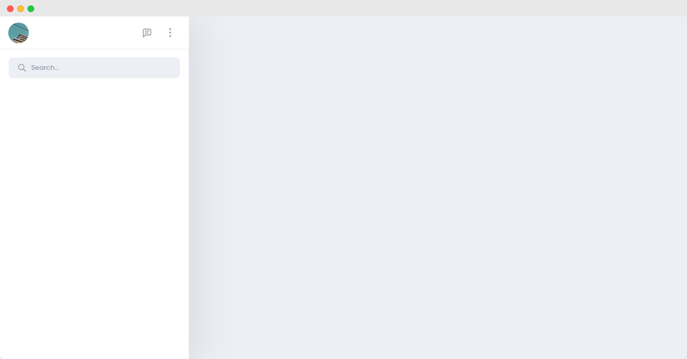

### Chat web app implementation built with:
- `fastify` as server
- `mongodb` as database
- `caddy` for load balancer and reverse proxy
- `upstash redis` for communicating across multiple server instance
- `socket.io` for realtime communication 
- `docker & docker-compose` for containerize the application
- `react` for client interface
- `styled-component` for styling
- `framer-motion` for animation

 

## License

MIT License.
